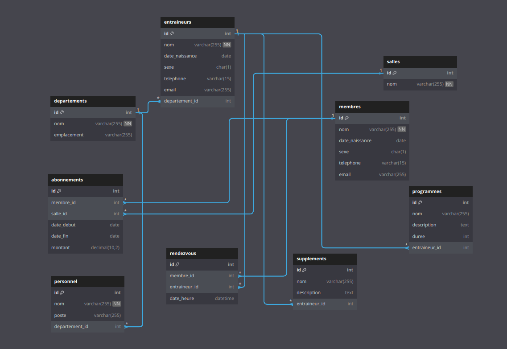

## Diagramme des relations

# Relations entre les tables

### Departements à Entraineurs :
- **Relation** : Un à plusieurs (One-to-Many)  
- **Explication** : Chaque département dans la table `departements` peut avoir plusieurs entraîneurs dans la table `entraineurs`. Un entraîneur appartient à un seul département, et la liaison se fait via `departement_id` dans la table `entraineurs`.

### Entraineurs à Rendezvous :
- **Relation** : Un à plusieurs (One-to-Many)  
- **Explication** : Chaque entraîneur dans la table `entraineurs` peut avoir plusieurs rendez-vous dans la table `rendezvous`. Un rendez-vous est lié à un seul entraîneur, et la liaison se fait via `entraineur_id` dans la table `rendezvous`.

### Entraineurs à Supplements :
- **Relation** : Un à plusieurs (One-to-Many)  
- **Explication** : Chaque entraîneur dans la table `entraineurs` peut recommander plusieurs suppléments dans la table `supplements`. Un supplément est lié à un seul entraîneur, et la liaison se fait via `entraineur_id` dans la table `supplements`.

### Membres à Abonnements :
- **Relation** : Un à plusieurs (One-to-Many)  
- **Explication** : Chaque membre dans la table `membres` peut avoir plusieurs abonnements dans la table `abonnements`. Un abonnement est lié à un seul membre, et la liaison se fait via `membre_id` dans la table `abonnements`.

### Membres à Rendezvous :
- **Relation** : Un à plusieurs (One-to-Many)  
- **Explication** : Chaque membre dans la table `membres` peut avoir plusieurs rendez-vous dans la table `rendezvous`. Un rendez-vous est lié à un seul membre, et la liaison se fait via `membre_id` dans la table `rendezvous`.

### Salles à Abonnements :
- **Relation** : Un à plusieurs (One-to-Many)  
- **Explication** : Chaque salle dans la table `salles` peut avoir plusieurs abonnements dans la table `abonnements`. Un abonnement est lié à une seule salle, et la liaison se fait via `salle_id` dans la table `abonnements`.

### Programmes à Entraineurs :
- **Relation** : Un à plusieurs (One-to-Many)  
- **Explication** : Chaque programme dans la table `programmes` peut être lié à un seul entraîneur dans la table `entraineurs`. La liaison se fait via `entraineur_id` dans la table `programmes`.

### Personnel à Departements :
- **Relation** : Un à plusieurs (One-to-Many)  
- **Explication** : Chaque employé administratif dans la table `personnel` peut être lié à un seul département dans la table `departements`. La liaison se fait via `departement_id` dans la table `personnel`.

